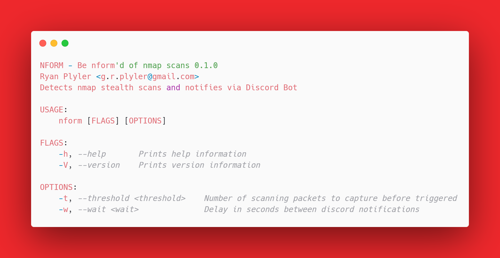
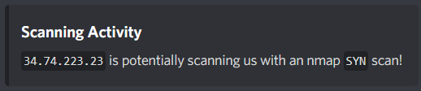

<h1 align="center">
  NFORM
</h1>

<h3 align="center">Detect NMAP stealth scans and notify via discord bot</h3>



<p align="center">
  <a href="#key-features">Key Features</a> •
  <a href="#download">Download</a> •
  <a href="#how-to-use">How To Use</a> •
  <a href="#examples">Examples</a> •
  <a href="#building">Building</a> •
  <a href="#contributing">Contributing</a> •
  <a href="#credits">Credits</a> •
  <a href="#license">License</a>
</p>


## Key Features
* **Detect nmap stealth scans**
    * Tested with `SYN`, `FIN`, `ACK`, `XMAS` and `NULL` tcp scans.
* **Simple Notifications**
    * Discord is currently supported, with other coming soon!
* **Small, Single Binary**
    * `nmap` tailored packet filtration and detection in a `6.8M` binary.
* **Fast and Memory Efficient**
    * nform uses about 3MB of memory when running and very little CPU (about 0.1% when I tested) even witn an `nmap -T5` scan
* **Portable**


## Download

```
wget https://github.com/grplyler/nform/releases/download/v0.2.0/nform
```

## How to Use

**Using nform on Linux (amd64)**


*Add Execute Permission*
```
chmod +x ./nform
```

*Run with defaults (uses main interface)*
```
./nform
```

*Output*
```
===== Config ===========================
Threshold: 5 (Only triggers after this many packets)
     Wait: 10 (Waits this many seconds before sending another Discord Message)
   Notify: Discord
========================================
Listening for nmap scans...
31.72.239.23 is potentially scanning us with an nmap SYN scan! (First Contact)
```

### Add Discord Bot for Notifications

By Default `nform` logs scanning activity to the console. But you can set the `DISCORD_TOKEN` and `DISCORD_CHANNEL_ID` evironment variables to enabled Discord Bot Notifications. See [Creating a Discord Bot](https://www.sitepoint.com/discord-bot-node-js/) to setup and authenticate a Discord Bot


*On Linux*
```
export DISCORD_TOKEN=yourdiscordtoken
export DISCORD_CHANNEL_ID=yourdiscordchannelid
```

*Example Message*



## Examples

*Add a longer delay for discord so you don't get spammed (2 mins)*

This will inform you via discord after the first packet threshold is triggered (default is 10 packets) and again after the wait time in seconds
```
./nform -w 120
```

*Make nform less sensitive but adjusting packet threshold to 100*
```
./nform -t 100
```

*Mix it up, make nform very sensitive, but only notify once a minute*
```
./nform -t 5 -w 60
```

## Building

Heres how you build from source.

## Building on Linux

Install the rust toolchain with [rustup](https://www.rust-lang.org/tools/install) if you don't already have it.

Install libpcap-dev (Ubuntu & Debian Variants)

```
apt-get install libpcap-dev
```

Clone the repo
```
git clone https://github.com/grplyler/nform.git
```

Build!
```
cd nform
cargo build
cargo run
```

Building for realease

```
cargo build --release
```

Binaries will be at `./target/debug/nform` and `./target/release/nform`

### Building on Windows with WinPCap/npcap

Coming soon! xD

## Rationale

I wrote this little tool to accomplish the following goals
* Learn Rust
* Have very simple recon intrusion detection without having to install something heavier like `snort` or the like.
* Explore Packets at the Layer 2 Level (For my Major in Networking & Security)

## Disclaimer

The code and executables in this project are a **work in progress**. While they can be used an tools/toys and what have you, they are not production ready and **shouldn't be used on crital systems** without understanding these disclaimers. 

Also, as I am very new to the Rust language, I am sure the code is much messier than nessecary, so I welcome constructive critisism, comments, and pull requests!

## Contributing

If you like this project, here are some ways you can contribute!

* Feature Requests
* Bug Reports (Although writing in Rust means significantly less bugs)
* Platform Testing

## Todo

* [ ] Add interface select other than the main interface
* [ ] Add Support for Windows
* [ ] Add Support for Mac 
* [ ] Add other notification mechanisms (Suggest some!)
* [ ] Add automatic IP blocking

## Credits

This software uses the following open source packages:

- [libpcap](https://nodejs.org/) (For portable packet capture)
- [tcpdump](https://www.tcpdump.org/) (For initial testing)
- [pcap](https://crates.io/crates/pcap) (Rust bindings for libpcap)
- [hex](https://crates.io/crates/hex) (Rust library for hex conversion)
- [reqwest](https://crates.io/crates/reqwest) (Rust library for http requests)
- [clap](https://crates.io/crates/clap) (Expressive Argument Parser for Rust)
- [Carbon](http://carbon.now.sh) (Code Screenshots)

## License

MIT


